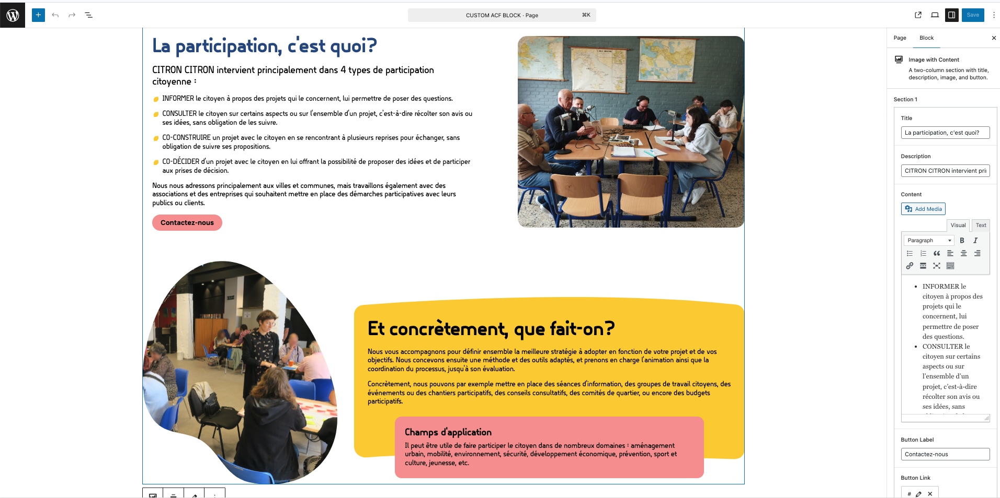
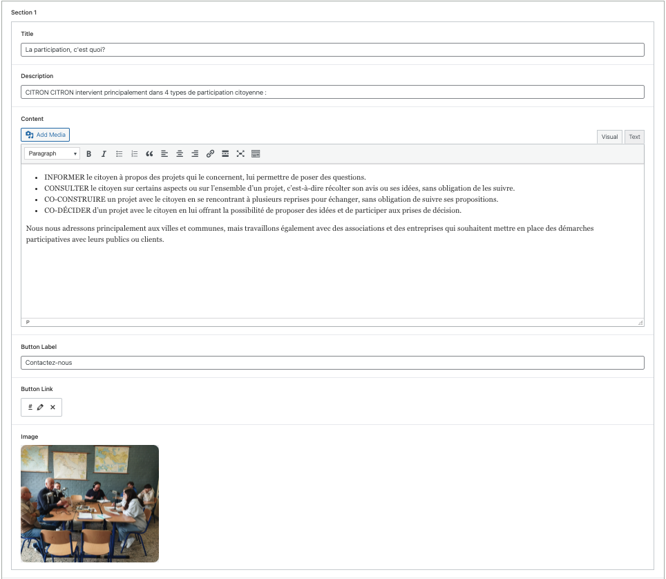
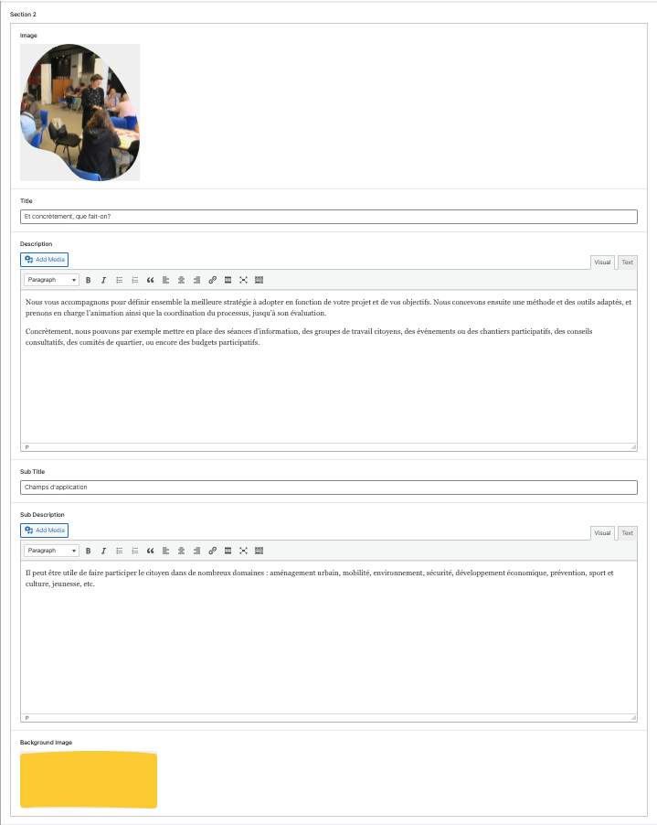

# CreedAlly ACF Blocks

A WordPress plugin that allows you to register **custom Gutenberg blocks** using **Advanced Custom Fields (ACF) Pro**.

## 🚀 Features

- Register ACF blocks via `block.json` with custom render templates.
- Tailwind CSS for consistent design across all blocks.
- Structured plugin with Composer, PHPCS, and PostCSS for modern development workflows.
- Custom block category: `CreedAlly Blocks`.

## 🛠️ Requirements

- WordPress
- ACF Pro (Required)
- PHP 7.4+
- Composer
- Node.js (for build process)

## 📦 Installation

1. Clone or download this repository into your `/wp-content/plugins/` directory:

   ```bash
   git clone https://github.com/creedally/ca-acf-blocks.git

2. Navigate into the plugin directory:

    ```bash
    cd ca-acf-blocks

3. Install PHP dependencies:

    ```bash
    composer install

4. Install Node dependencies:

    ```bash
    npm install

5. Build assets:

    ```bash
    npm run build

6. Activate the plugin from the WordPress Admin → Plugins.


## 🧱 Registering New Blocks

Each block is a directory under /blocks/ with:

- block.json → block definition
- template.php → render template
- ACF field group bound to the block via acf_register_block_type

Blocks are auto-registered during acf/init.

Example block.json snippet:

    {
        "name": "ca-acf-blocks/image-with-content",
        "title": "Image with Content",
        "description": "A two-column section with title, description, image, and button.",
        "category": "ca-acf-blocks",
        "icon": "cover-image",
        "keywords": [ "banner", "section", "image", "text"],
        "attributes": {},
        "supports": {
            "align": true,
            "mode": true,
            "html": false
        }
    }

## 🧪 Development

1. Lint PHP

    ```bash
    composer run lint

2. Watch & Build Assets    

    ```bash
    npm run dev
    npm run build

## 🧰 Tools & Tech Stack

- ACF Pro
- Tailwind CSS
- PostCSS
- PHPCS
- WordPress Coding Standards

## ⚙️ Setup Instructions

1. 🔌 Install ACF Pro

If not already installed, you must install ACF Pro.
It’s required for registering and rendering ACF-based custom blocks.

2. ⬇️ Import ACF Field Groups via ACF Import Tool

The plugin ships with pre-built ACF field groups stored as JSON inside the acf-blocks-json/ folder. You’ll need to import them once using ACF’s built-in tools.

👉 Steps:

- Go to WordPress Dashboard → Custom Fields → Tools
- Under the Import Field Groups section:
  - Click Choose File
  - Select a file from: wp-content/plugins/ca-acf-blocks/acf-blocks-json/image-with-content.json
- Click Import File

✅ The field group will now appear in Custom Fields → Field Groups, and the block will appear in the Gutenberg editor.

3. 🧩 Insert the Block in the Editor

- Open any page/post.
- Click Add Block (+) and search for Image with Content or any block title you’ve registered.
- Fill in fields from the ACF sidebar and save.

## 📸 Screenshots

### 1. Frontend Output


### 2. Editor Output


### 3. Blocks Fields

#### 1. Section One


#### 2. Section Two


#### 3. Section Background

